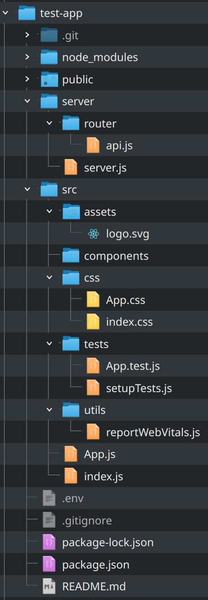

Setting Up A React App Project
------

### What Steps The Script Takes:
1. Create the React project
2. Tidy up src folder (assets, components, tests, utils, css)
3. Create server folder and populates the following files with template code
    * server.js
    * api.js with basic route with GET and POST requests
    * .env file
4. Install dependencies
5. Wait for dependencies to have been installed

## Installation and Use
To use the script, put the script in the location you'd like to create the React App and run the following commands:

To make the script executable:
`chmod +x create-react-app.sh`

To run the script
`./create-react-app.sh`

#### For Mac, Linux or Unix:
All you have to do is run this in your standard terminal. It should work fine for both Bash and ZSH shells.

#### For Windows:
Download and open `git bash` to run this script.

### Bash Script Features To Add:
* Bootstrap React core components for styling - MaterialsUI
* Basic template components
    + Header
    + Footer
    + NavBar
    + Form
    + Carousel
    + Card structure
* Testing
* Correct file paths in App.js and index.js
* Set up package.json with concurrently
* Add basic get and post request to App.js

### Known Bugs
